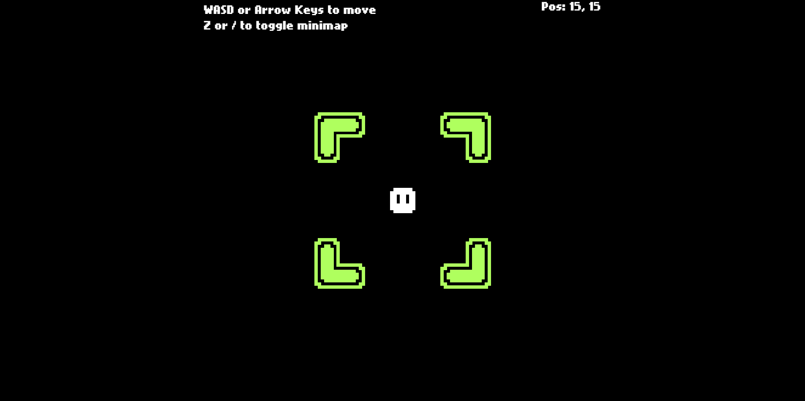
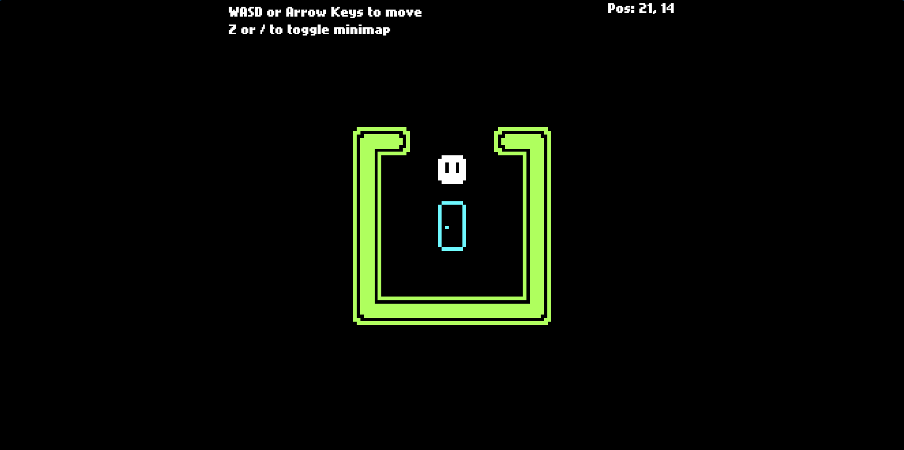
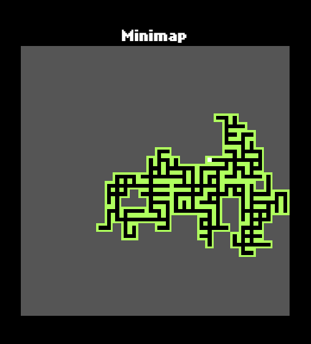
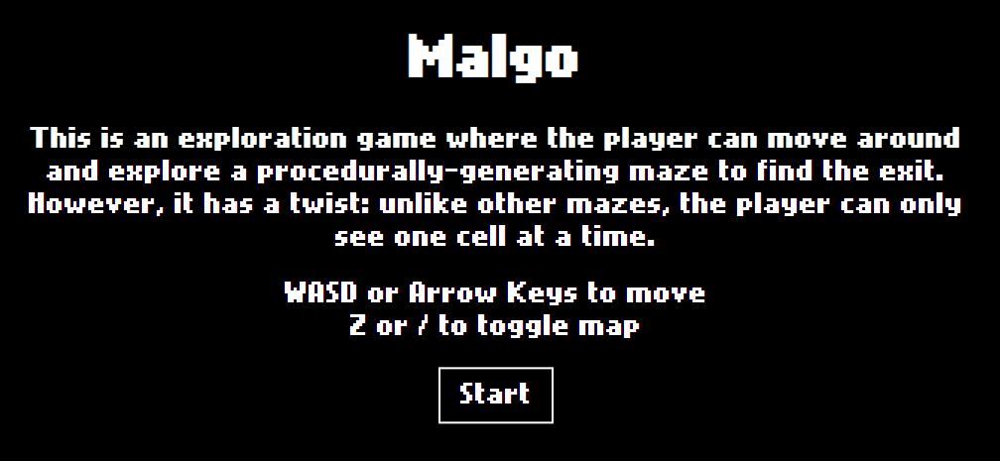

# Malgo
## About
Malgo is an exploration game where the player can move around and explore a procedurally-generating maze to find the exit. However, it has a twist: unlike other mazes, the player can only see one cell at a time.

**PLAY AT https://devsai9.github.io/malgo/**

## How to play
**VIEW:** The player can see one cell at a time. 
**MOVEMENT:** The player can move around using WASD or the arrow keys. 
**MINIMAP:** The minimap can be toggled with Z or forward slash (/). The walls are green, the standable area is black, the player's current location is a white dot, and any unexplored cells are gray. 
**GOAL:** The goal is to find the exit of the maze.

Starting Cell:  

Exit Cell: 

Minimap: 

Watch the gameplay: 

## Languages and Tools
- HTML
- HTML Canvas
- CSS
- JavaScript
- Visual Studio Code
- Git & GitHub